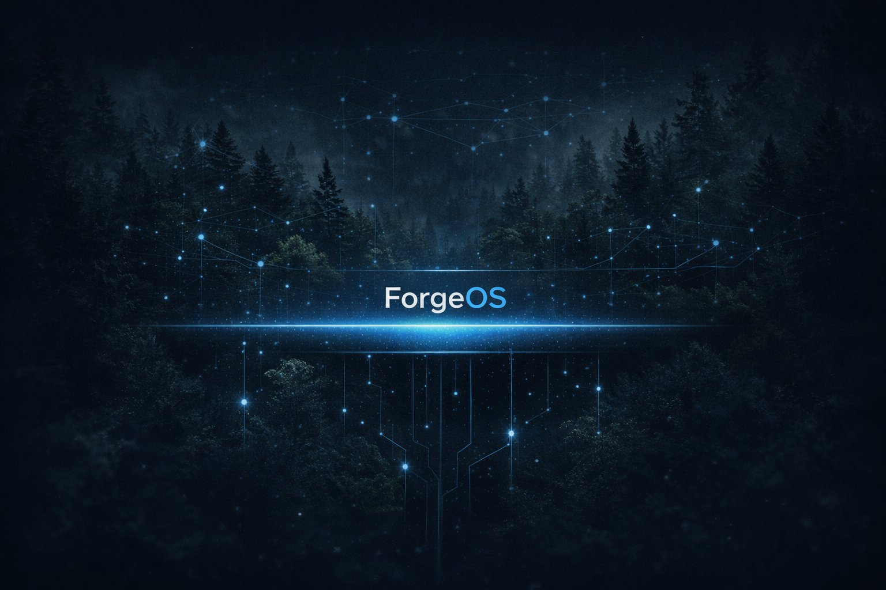
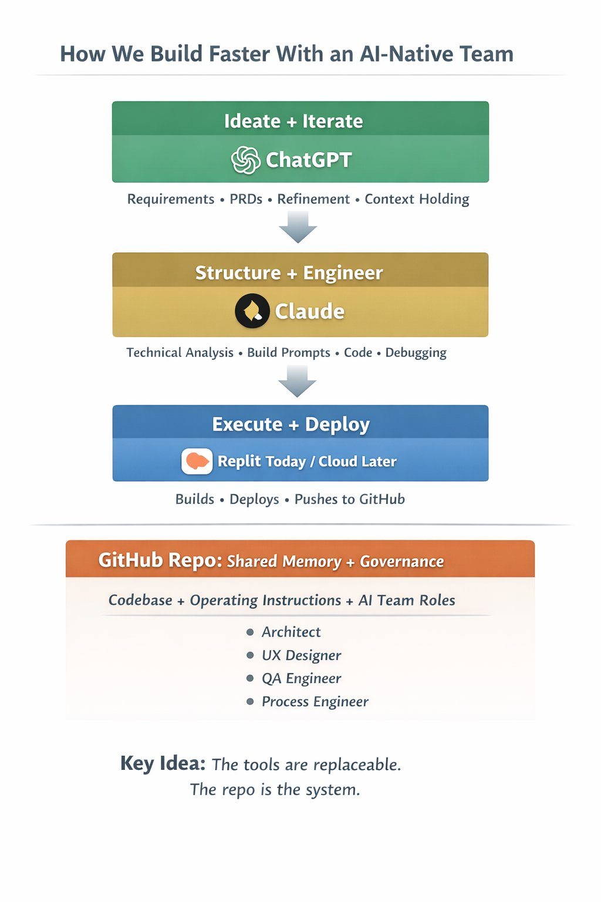

  

  <strong>Turn vibe coding into a production-ready workflow.</strong>

  Go from idea → shipped software using AI tools, structured artifacts, and lightweight constraints.

---

## What is ForgeOS?

If you’re building with ChatGPT, Claude, Replit, Cursor, or similar tools, you can move fast—but things break down:

- Requirements are unclear or incomplete  
- Outputs vary between runs  
- Context gets lost between tools  
- Features don’t ship cleanly  
- You spend more time fixing than building  

ForgeOS adds just enough structure to fix this.

It’s not a tool. It’s a loop.

---

## The ForgeOS Loop

Every feature follows the same flow:

Idea → READY → PRD → BUILD → DONE → LEARNING → Next Idea

- **READY** — clarify what you’re building (2 minutes)  
- **PRD** — generate a buildable spec (ChatGPT)  
- **BUILD** — generate and implement (Claude → Replit)  
- **DONE** — validate against intent  
- **LEARNING** — capture what actually happened  

This keeps speed high while preventing chaos.

---

## Why This Exists

Most AI workflows look like this:

Human → AI → Output → Problems → Human fixes → Repeat
Or worse:

Agent A → Agent B → Agent C → ??? → Output

Outputs are inconsistent. Context is lost. Debugging is guesswork.

ForgeOS solves this by:

- Structuring work into small, shippable units  
- Using artifacts instead of conversations  
- Adding lightweight constraints at key points  
- Keeping humans in control of decisions  

---

## What ForgeOS Actually Does

ForgeOS turns fast, messy “vibe coding” into a controlled system that can ship.

It does this by:

- Defining a **unit of work** (Feature Card)  
- Standardizing handoffs between tools  
- Constraining what enters the system (READY)  
- Constraining what leaves the system (DONE)  
- Capturing learning so each step improves the next  

---

## Run your first feature (15–30 min)

1. Copy the Feature Card template  
2. Fill out READY (2 minutes)  
3. Generate a PRD using ChatGPT  
4. Generate a build prompt using Claude  
5. Implement in Replit (or your IDE)  
6. Complete the DONE check  
7. Capture LEARNING  

That’s it.

---

## The Constraint

The bottleneck is not coding.

The bottleneck is **decision-making**.

ForgeOS is designed around this:

- AI accelerates execution  
- Humans control direction  
- The system limits work to what can be validated  

This prevents the “AI inventory trap” where speed creates more problems than progress.

---

## What This Is (and Isn’t)

**This is:**
- A workflow for shipping AI-built software  
- A way for a single builder to operate like a team  
- A system for controlling speed  

**This is not:**
- An agent framework  
- A no-code tool  
- A fully automated pipeline  

---

  

